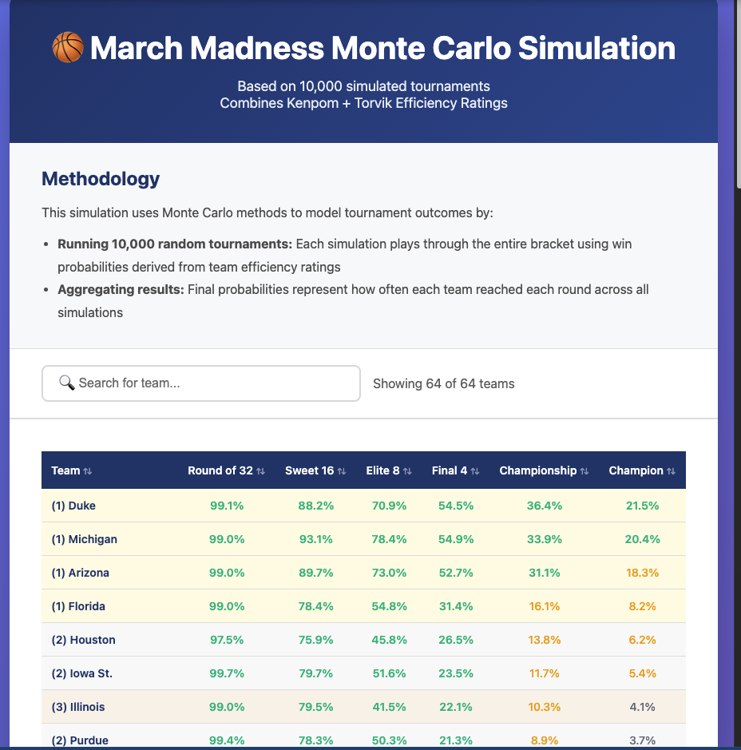

# March Madness Monte Carlo Simulator

A probabilistic NCAAW Tournament simulator that combines Kenpom and Torvik efficiency ratings with Monte Carlo Simulation to predict future tournament outcomes.


## Overview

This project simulates the NCAA March Madness tournament by running 10,000+ random tournament paths using win probabilities derived from advanced basketball metrics. 

**Example Results of the 1 Seeds in 2026:**
- Duke: 21.8% championship probability 
- Michigan: 20.6% 
- Arizona: 18.3%
- Florida: 8.1%


## Features

- **Monte Carlo Simulation**: Runs 10,000+ tournament simulations to calculate advance probabilities
- **Dual-Model Approach**: Combines Kenpom and Torvik efficiency ratings for robust predictions
- **Interactive HTML Output**: Searchable, sortable results table with probability highlighting
- **Clean Modular Code**: Separated concerns for maintainability and testing

## Quick Start

### Installation

```bash
# Clone the repository
git clone https://github.com/yourusername/March-Madness-Monte-Carlo-Simulation.git
cd March-Madness-Monte-Carlo-Simulation

# Install dependencies
pip install -r requirements.txt
```

### Running the Simulation

```bash
# From the project root directory
cd src
python test_monte_carlo_.py
```

This will:
1. Load tournament data from CSV files
2. Run 10,000 Monte Carlo simulations
3. Generate `monte_carlo_results.html` with interactive results

### Viewing Results

Open `outputs/monte_carlo_results.html` from your folder then it should open in your browser to see:
- All 68 teams' advance probabilities for each round
- Searchable/sortable interactive table
- Color-coded by seed with probability highlighting
- Methodology explanation

**See example output** -- Example from actual simulation run



## Methodology

### 1. Data Sources
- **Kenpom**: Adjusted offensive/defensive efficiency and tempo
- **Torvik**: Independent efficiency ratings for validation

### 2. Score Prediction
For each matchup, predicted scores are calculated using:
```
Score = (Team AdjO × Opponent AdjD × Tempo) / (D1_avg_def × 100)
```

The model averages Kenpom and Torvik predictions for accuracy.

### 3. Win Probability Conversion
Point spreads are converted to win probabilities using empirical lookup tables based on historical NCAA tournament data.

### 4. Monte Carlo Simulation
```python
for simulation in range(10000):
    bracket = simulate_tournament()
    # For each game:
    #   - Calculate win probability
    #   - Random outcome: if random() < win_prob, team1 wins
    #   - Advance winner to next round
    record_results(bracket)

# Convert counts to probabilities
for team in all_teams:
    team.championship_prob = times_won_championship / 10000
```

### 5. Why Monte Carlo?
- **Captures path dependency**: Early upsets change everyone's bracket position
- **Models variance**: Shows distribution of outcomes, not just point estimates
- **Industry standard**: Used by professional sports analytics
- **Interpretable**: "Ran 10,000 tournaments" is easier to explain than complex probability trees

### Key Technologies
- **Python 3.8+**: Core simulation logic
- **Pandas**: Data manipulation and analysis
- **HTML/CSS/JavaScript**: Interactive results visualization

### Performance
- Simulates 10,000 complete tournaments in ~30-60 seconds
- Processes 67 games per tournament × 10,000 = 670,000 game simulations
- Efficient probability lookup using pre-computed spread-to-win tables

## Sample Output

**Championship Probabilities for 2026 (Top 10):**
```
(1) Duke:      20.8%
(1) Michigan:  20.8%
(1) Arizona:   18.2%
(1) Florida:    8.3%
(2) Houston:    6.4%
(2) Iowa St.:   5.6%
(3) Illinois:   4.5%
(2) Purdue:     3.9%
(2) UConn:      2.3%
(3) Gonzaga:    1.5%
```

**Full advance probabilities** available in the HTML output for all teams and all rounds.

## Note on Play-In Games

This simulation uses the first team listed in play-in matchups as a simplification. For most accurate results, update the bracket in `src/simulate_monte_carlo.py` after play-in games are completed.

Current play-ins:
- (11)Texas vs (11)N.C. State → Update to winner
- (16)UMBC vs(16)Howard → Update to winner
- (11)SMU vs (11)Miami OH → Update to winner
- (16)Prairie View A&M vs(16)Lehigh → Update to winner

## Requirements

```
pandas>=1.3.0
```
## Contributing

This is a personal portfolio project, but suggestions and feedback are welcome! Feel free to open an issue if you find bugs or have ideas for improvements.

## License

MIT License - feel free to use this code for your own projects.

## Acknowledgments

- **Kenpom** (kenpom.com) - Advanced basketball analytics
- **Torvik** (barttorvik.com) - Basketball efficiency ratings

**Note**: This simulator is for educational and analytical purposes.